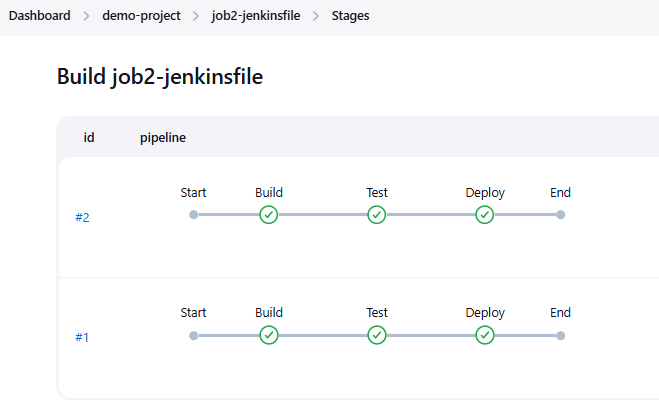

## Jenkins File:

A Jenkinsfile is a text file that contains the definition of a Jenkins pipeline and is typically stored in the root of a project repository. It allows you to define build, test, and deployment steps in code, enabling continuous integration and continuous delivery (CI/CD) pipelines.


_Jenkins File two types:_ 
- Declarative Pipeline (preferred for simplicity)
- Scripted Pipeline (more flexible, written in Groovy)


- **Declarative**: Declarative pipeline syntax offers an easy way to create pipelines. It contains a predefined hierarchy to create Jenkins pipelines. It gives you the ability to control all aspects of a pipeline execution in a simple, straight-forward manner.

- **Scripted**: Scripted Jenkins pipeline runs on the Jenkins master with the help of a lightweight executor. It uses very few resources to translate the pipeline into atomic commands. Both declarative and scripted syntax are different from each other and are defined totally differently.


### Jenkins Pipeline Concepts:


- `pipeline`:	The pipeline is a set of instructions given in the form of code for continuous delivery and consists of instructions needed for the entire build process. With pipeline, you can build, test, and deliver the application.

- `agent`: Specify where the Jenkins build job should run. agent can be at pipeline level or stage level. **It’s mandatory to define an agent**.

- `label`: Run the job in agent which matches the `label` given here. Remember Jenkins CI/CD can work on Master/Agent architecture. Master nodes can delegate the jobs to run in Agent nodes. Nodes on creation given a name & label to identify them later.

- `node`:	The machine on which Jenkins runs is called a node. A node block is mainly used in scripted pipeline syntax.

- `stages`: stages block constitutes different executable stage blocks. **At least one stage block is mandatory inside stages block**.

- `stage`: A stage block contains a series of steps in a pipeline. That is, the build, test, and deploy processes all come together in a stage. Generally, a stage block is used to visualize the Jenkins pipeline process.

- `steps`: steps block contains the actual build step. It’s mandatory to have at least one step block inside a stage block. A step is nothing but a single task that executes a specific process at a defined time. A pipeline involves a series of steps.


#### `post` block: 
- Conventionally, the post section should be placed at the end of the Pipeline.

```
    post { 
        always { 
            echo 'I will always say Hello again!'
        }
    }
```


- `always`: Run the steps in the post section regardless of the completion status of the Pipeline’s or stage’s run.

- `failure`: Only run the steps in post if the current Pipeline’s or stage’s run has a "failed" status, typically denoted by red in the web UI.

- `success`: Only run the steps in post if the current Pipeline’s or stage’s run has a "success" status, typically denoted by blue or green in the web UI.

- `unstable`: Only run the steps in post if the current Pipeline’s run has an "unstable" status, usually caused by test failures, code violations, etc. This is typically denoted by yellow in the web UI.

- `unsuccessful`: Only run the steps in post if the current Pipeline’s or stage’s run has not a "success" status. This is typically denoted in the web UI depending on the status previously mentioned (for stages this may fire if the build itself is unstable).

- `cleanup`: Run the steps in this post condition after every other post condition has been evaluated, regardless of the Pipeline or stage’s status.


#### Common Features You Can Use:
- agent { label 'my-node1' } – Choose specific Jenkins nodes.
- environment { VAR = 'value' } – Set environment variables.
- tools { jdk 'JDK11' } – Use toolchains like JDK, Maven.
- post { always { ... } } – Add post-build actions.


### Jenkinsfile Declarative Pipeline:

#### Example-1:

```
pipeline {
    agent any

    stages {

        stage('Demo') {
            steps {
                echo 'Hello World...'
                sh 'mkdir -p mydir'
            }
        }

    }
}
```


#### Example-2:

```
pipeline {
    agent any

    stages {

        stage('Build') {
            steps {
                echo 'Building...'
            }
        }

        stage('Test') {
            steps {
                echo 'Testing...'
            }
        }

        stage('Deploy') {
            steps {
                echo 'Deploying...'
            }
        }

    }
}

```





### Jenkins Job Location: 

On the Jenkins server, job data is stored under the `$JENKINS_HOME/jobs` directory. Each job has its own folder.

_Inside this folder you’ll find:_

- `config.xml` : the actual job configuration
- `builds/` : folder containing historical builds
- `nextBuildNumber` : keeps track of build count


```
ll /var/lib/jenkins/jobs/demo-project/jobs

drwxr-xr-x 3 jenkins jenkins 82 Apr 15 03:27 job1-jenkinsfile
drwxr-xr-x 3 jenkins jenkins 82 Apr 15 03:33 job2-jenkinsfile
```


```
ll /var/lib/jenkins/workspace/demo-project/

drwxr-xr-x 3 jenkins jenkins  19 Apr 15 04:37 job1-jenkinsfile
drwxr-xr-x 4 jenkins jenkins 117 Apr 15 03:33 job2-jenkinsfile
```


### Environment variable:

- `${env.VAR_NAME}` is used to access environment variables in Groovy/`echo`.
- `$VAR_NAME` is used in shell steps (`sh`).


#### Example-3: 

```
pipeline {
    agent any

    environment {
	    USER_NAME = "devops"
	    PASSWORD = credentials('git_auth')
        BUILD_DIR = 'build/output'
    }

    stages{

	    stage("Username"){
		    steps {
		        echo "User name is ${env.USER_NAME}"
		        echo "User Passwd is ${env.PASSWORD}"
                sh 'mkdir -p $BUILD_DIR'
		    }
	    }

    }
}

```


#### Example-4: 

```
pipeline {
    agent any
	
    environment { 
        DEPLOY_TO = 'prod'
    }
	
    stages {

        stage('Deploy') {
            steps {
                echo "${env.DEPLOY_TO}"
            }
        }
		
    }
 }
```


#### Example-5: 

- This binds the credentials with ID `git_auth` to env vars
- Jenkins will automatically expose `MY_CRED_USR` and `MY_CRED_PSW`

```
pipeline {
    agent any
	
   environment { 
        MY_CRED = credentials('git_auth') 
    }
	
    stages {

        stage('Load Credentials') {
            steps {
                echo "Using credentials:"
                echo "Username is $MY_CRED_USR"
                echo "Password is $MY_CRED_PSW"
            }
        }

        stage("Env Build Number") {
            steps {
                echo "Current Build number: ${env.BUILD_NUMBER}"
            }
        }

    }
}
```


### Jenkinsfile Basic Example:

#### Example-6: 

```
pipeline {
    agent any

    stages {

        stage('env_list') {
            steps {
                sh 'printenv | sort'
            }
        }
        
    }
}
```


#### Example-7:

- Must be installed `git`.
- On Jenkins server set as Labels: `master-node`


```
pipeline {
    
    agent {
        label 'master-node'
    }
	
	stages {
        stage('git checkout') {
            steps {
               //git branch: 'main', credentialsId: 'git_auth', url: 'https://github.com/technbd/java-maven-project.git'
               git branch: 'main', url: 'https://github.com/mdrajibkhan/docker-java-jenkinsfile-registry.git'
            }
        }
        
		stage('maven build') {
            steps {
                echo "mvn clean package"
                //sh "mvn clean package"
            }
        }
        
    }
}
```


#### Example-8:

```
pipeline {
    agent any
    
    stages {
	
        stage('Git Pull') {
            steps {
                echo 'Pull from Git...'
                git branch: 'main', url: 'https://github.com/mdrajibkhan/docker-java-jenkinsfile-registry.git'
				
            }
        }
        
        stage('Build App') {
            steps {
                echo 'Building App...'
                //sh 'make build'
                
            }
        }
        
          stage('Unit Test') {
            steps {
                echo 'Unit Test...'
                //sh 'make test'
                
            }
        }
        
          stage('Deploy App') {
            steps {
                echo 'Deploy App...'
                //sh './deploy.sh'
            }
        }
        
        
    }
}
```


#### Example-9: 

```
pipeline {
    agent any
    
    tools {
	jdk 'JAVA_HOME'
	}
    
    stages {

        stage('verify java home') {
            steps {
                echo "${JAVA_HOME}"
            }
        }
        
    }
}
```


#### Example-10: 

```
pipeline {
    agent any
	
    tools {
        maven 'MAVEN_HOME' 
    }
	
    stages {

         stage('verify MVN version') {
              steps {
                 sh "mvn -version"
              }
         }
		 
     }
}
```


### Example-11: 

- On Jenkins server set as Labels: `master-node`

```
pipeline {
    //agent any

    agent {
        //label 'master-node'
         label 'remote-slave1'
    }

    /*
    triggers{ 
        cron('@midnight')
    }*/

    environment {
        BRANCH_NAME="main"
        GIT_REPO="https://github.com/mdrajibkhan/docker-java-jenkinsfile-registry.git"
         
    }

    stages {
  
        stage('SCM'){
            steps{
                //git branch: "${env.BRANCH_NAME}", credentialsId: 'git_auth', url: "${env.GIT_REPO}"
                git branch: "${env.BRANCH_NAME}", url: "${env.GIT_REPO}"
            }
        }
		
        stage('Build App') {
            steps {
                echo 'Build App...'
                
            }
        }
        
        stage('Unit Test') {
            steps {
                echo 'Unit Test...'
                
            }
        }
        
        stage('Deploy App') {
            steps {
                echo 'Deploy App...'
                
            }
        }

    }
}

```


### Example-12: 

- Must be installed 'Maven' and set the `MAVEN_HOME` directory. 
- Git checkout -> maven version -> maven build

```
pipeline {
    agent {
        label 'master-node'
    }
   
   tools {
        maven 'MAVEN_HOME' 
    }
   
       stages {

        stage('git checkout') {
            steps {
               git branch: 'main', url: 'https://github.com/technbd/java-maven-project.git'
            }
        }
        
        stage('maven version') {
            steps {
               sh "mvn -v"
            }
        }
        
       stage('maven build') {
            steps {
               sh "mvn clean package"
            }
        }
    }

        post {
        always {
                cleanWs()
            }
        }

}
```


### Example-13: (SUCCESS)

```
pipeline {
    agent any

    stages {

        stage('Docker Login') {
            steps {
                withCredentials([usernamePassword(credentialsId: 'docker_auth', passwordVariable: 'docker_pw', usernameVariable: 'docker_user')]) {
                sh "docker login -u ${env.docker_user} -p ${env.docker_pw}"
                
                }
            }
        }

    }

    post {
        always {
            sh 'docker logout'
        }
    }

}

```


### Example-14: (SUCCESS)


```
environment {
    DOCKER_CREDS = credentials('docker_auth')
}
```

The above credential environment variable `DOCKER_CREDS` contains a username and a password separated by a colon in the format like `username:password`. It will create two additional variable automatically with the same environment variable appended with `_USR` and `_PSW`

- `DOCKER_CREDS_USR` - contains the username.
- `DOCKER_CREDS_PSW` - contains the password.


```
pipeline {
    agent any

    environment {
        DOCKER_CREDS = credentials('docker_auth')
        DOCKER_REGISTRY = 'https://index.docker.io/v1/' // or: your private registry
    }

    stages {

        stage('Docker Build') {
			steps {
                echo "docker build -t technbd/tomcat:v1 ."
				//sh 'docker build -t technbd/tomcat:v1 .'
            }
        }

        stage('Docker Login') {
            steps {
                sh 'docker login -u $DOCKER_CREDS_USR -p $DOCKER_CREDS_PSW $DOCKER_REGISTRY'
                //sh ' echo $DOCKER_CREDS_PSW | docker login -u $DOCKER_CREDS_USR --password-stdin $DOCKER_REGISTRY'

            }
        }

        stage('Docker Push') {
			steps {
                echo "docker push technbd/tomcat:v1"
				//sh 'docker push technbd/tomcat:v1'
            }
        }

        stage('Pull and deploy') {
			steps {
                echo "docker pull technbd/tomcat:v1"
                echo "docker run --name web1 -dit -p 8081:8080 technbd/tomcat:v1"

				//sh 'docker rm web1 -f'
				//sh 'docker pull technbd/tomcat:v1'
				//sh 'docker run --name web1 -dit -p 8081:8080 technbd/tomcat:v1'
			}
        }

    }

    post {
        always {
            sh 'docker logout'
        }
    }

}

```


### Multiline shell commands:

Below is an example of using a multi-line sh step in a Jenkins pipeline. This allows you to run multiple shell commands in a single sh step using a multiline string.

- The `sh` step is given a multi-line string using triple single-quotes (`'''`) to run multiple shell commands.
- A multi-line sh block with triple double-quotes (`"""`) inside a script block, which is valid Groovy syntax.
- `Note`: If you ever need to use Groovy variables inside the shell block, then you'd need to use double quotes (`"""`) and `${}` to interpolate. But for plain shell commands like in your example, `'''` is totally fine.


#### Example-15:

```
pipeline {
    agent any

    stages {
        
        stage('Build') {
            steps {
                sh '''
                    echo "Starting build process"
                    echo "Build the app"
                    echo "Deploying to production"
                '''
            }
        }

    }
}

```


#### Example-16:

```
pipeline {
    agent any

    environment {
        HELLO = "Hello World"
    }

    stages {
        
        stage('Build') {
            steps {
                sh """
                    hostname
                    whoami
                    echo ${HELLO}
                    uname -a
                """
            }
        }

    }
}

```


### `def` Keyword:

In a Jenkinsfile, which is written in **Groovy-based DSL**, you can define variables using the `def` keyword. 

- `def` defines a **local variable** in the Groovy `script { }` block. Variable definitions inside `script { }` blocks (Recommended for Declarative Pipelines)
- If you want a **global variable** (accessible in multiple stages), define it **outside** the `pipeline { }` block or use `env` for environment variables:


#### Local variable: 

```
pipeline {
    agent any
   
   tools {
        maven 'MAVEN_HOME' 
    }
   
    stages {

        stage('git checkout') {
            steps {
               git branch: 'main', url: 'https://github.com/technbd/docker-spring-boot-java.git'
            }
        }
        
        stage('maven version') {
            steps {
                script {
                    def MAVEN_VER = 'mvn -v'
                    sh "${MAVEN_VER}"
                }
            }
        }
        
       stage('maven build') {
            steps {
                script {
                    def BUILD = 'mvn clean package'
                    sh "${BUILD}"
                }
            }
        }
    
    }
}

```


#### Global variable:

```
def MAVEN_VER = 'mvn -v'
def BUILD = 'mvn clean package'

pipeline {
    agent any
   
   tools {
        maven 'MAVEN_HOME' 
    }
   
    stages {

        stage('git checkout') {
            steps {
               git branch: 'main', url: 'https://github.com/technbd/docker-spring-boot-java.git'
            }
        }
        
        stage('maven version') {
            steps {
                sh "${MAVEN_VER}"
            }
        }
        
       stage('maven build') {
            steps {
               sh "${BUILD}"
            }
        }
    
    }
}

```


### Links:
- [Pipeline Syntax](https://www.jenkins.io/doc/book/pipeline/syntax/)
- [Variables use to shell and batch build steps](http://192.168.10.193:8080/env-vars.html/)
- [Global Variable Reference](http://192.168.10.193:8080/job/demo-project/job/job1-jenkinsfile/pipeline-syntax/globals)


